# SkillGraph

**A career skill and learning path explorer, built on CognoDB.**

[](https://github.com/aqkprogrammer/skillgraph/actions/workflows/ci.yml)

SkillGraph maps how technical skills connect — to each other, to the roles that need them, to
the technologies built on them and to the resources that teach them — and then lets you *walk*
those connections. Pick a skill and see what to learn before it, what it unlocks, which careers it
opens up two or three hops away, and the shortest route from where you are to where you want to be.

It is a small application on purpose: ~133 nodes and 411 relationships, one screen per user
question, and a data layer you can read end to end in twenty minutes. Every Cypher query it runs is
documented in [`docs/queries.md`](docs/queries.md).

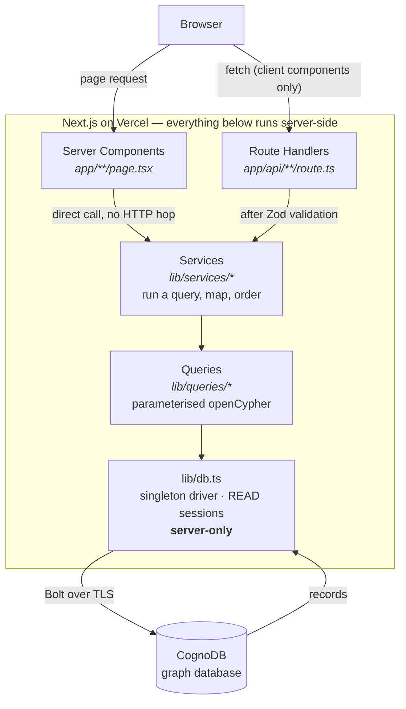

Credentials live only in the shaded box. `lib/db.ts` imports `server-only`, so a client component
importing it is a **build error** — a leak into the browser bundle cannot ship.

---

## Contents

- [Live demo](#live-demo)
- [Screenshots](#screenshots)
- [Why a graph database?](#why-a-graph-database)
- [The graph model](#the-graph-model)
- [How it works](#how-it-works)
  - [The request lifecycle](#the-request-lifecycle)
  - [User flows](#user-flows)
- [Features at a glance](#features-at-a-glance)
- [Getting started](#getting-started)
  - [1. Create a CognoDB instance](#1-create-a-cognodb-instance)
  - [2. Configure the application](#2-configure-the-application)
  - [3. Install, seed and run](#3-install-seed-and-run)
- [Environment variables](#environment-variables)
- [Project structure](#project-structure)
- [API](#api)
- [Scripts](#scripts)
- [Testing](#testing)
- [Deployment](#deployment)
- [Security](#security)
- [Performance](#performance)
- [Design decisions](#design-decisions)
- [What I would do with more time](#what-i-would-do-with-more-time)

---

## Live demo

### **▶ https://skillgraph-qadir-khan.vercel.app**

Running on Vercel against a live CognoDB free-tier instance. Good places to start:

| Link | What it shows |
|---|---|
| [Homepage](https://skillgraph-qadir-khan.vercel.app/) | Live graph inventory and the most in-demand skills |
| [React](https://skillgraph-qadir-khan.vercel.app/skills/react) | The skill explorer — scroll to **"Careers two or more hops away"** |
| [ML Engineer](https://skillgraph-qadir-khan.vercel.app/roles/ml-engineer) | Derived role similarity and **skill gaps** |
| [JavaScript → Machine Learning](https://skillgraph-qadir-khan.vercel.app/paths?from=javascript&to=machine-learning) | `shortestPath` across the graph |
| [HTML & CSS → Kubernetes](https://skillgraph-qadir-khan.vercel.app/paths?from=html-css&to=kubernetes) | The "no route exists" empty state |
| [Graph explorer](https://skillgraph-qadir-khan.vercel.app/explore?focus=react&depth=3) | Heterogeneous reachability within 3 hops |
| [Health check](https://skillgraph-qadir-khan.vercel.app/api/health) | `{ connected, seeded, stats }` straight from CognoDB |

**Repository:** https://github.com/aqkprogrammer/skillgraph

A demo recording outline is in [`docs/demo-script.md`](docs/demo-script.md).

---

## Screenshots

| | |
|---|---|
| 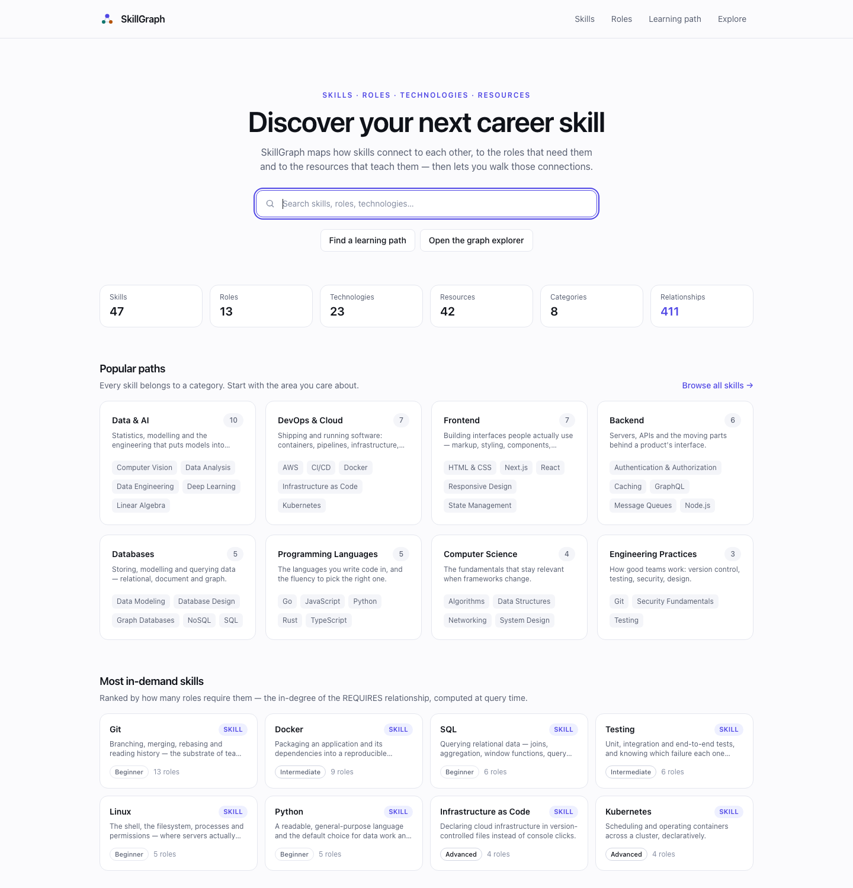 **Homepage** — search, inventory, popular paths, in-demand skills | 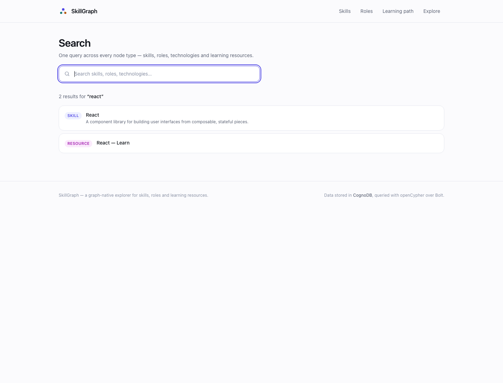 **Search** — one query across four node labels |
| 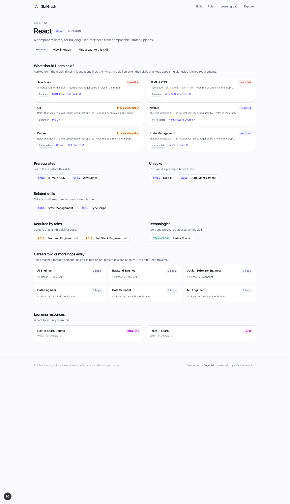 **Skill detail** — prerequisites, unlocks, roles, resources, multi-hop careers | 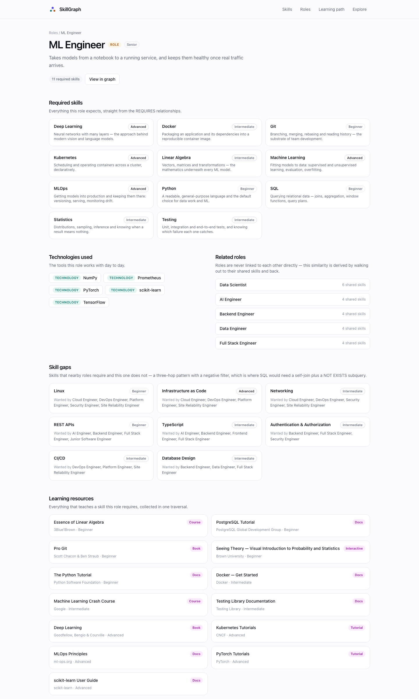 **Role detail** — required skills, related roles, skill gaps |
| 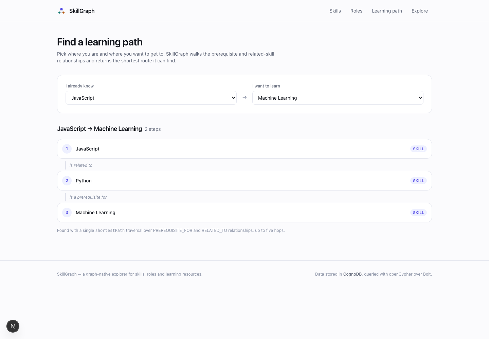 **Learning path** — shortest route between two skills | 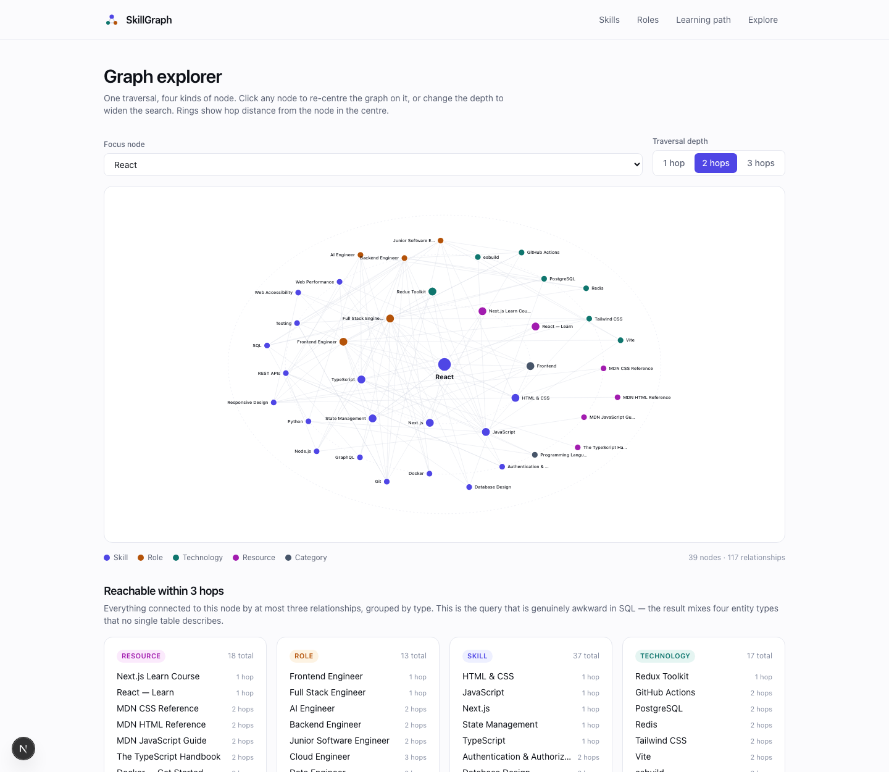 **Graph explorer** — the neighbourhood around a node |
| 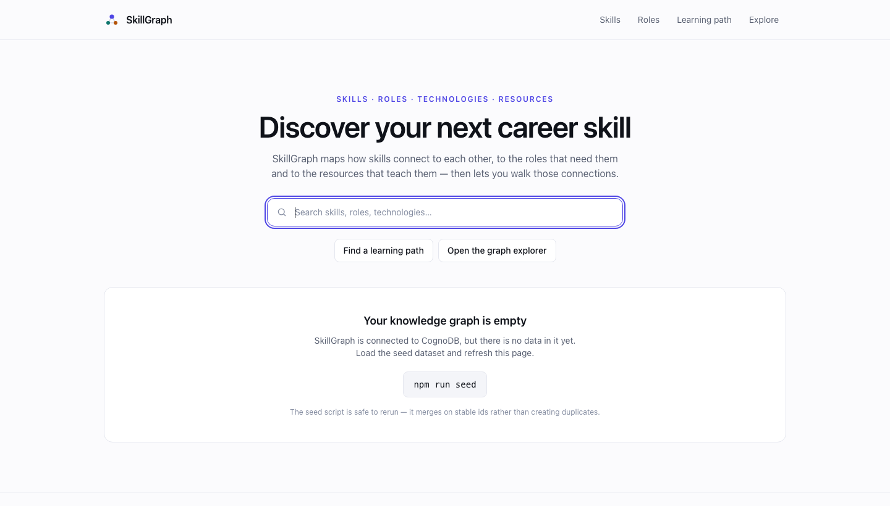 **First run** — connected, but nothing seeded yet | 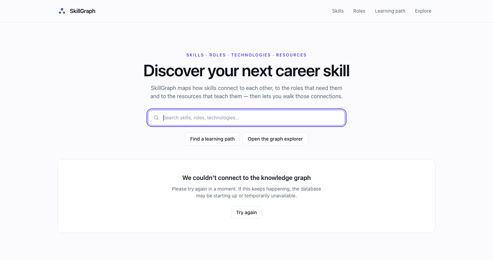 **Database unavailable** — one sentence, no internal detail |

See [`docs/screenshots/README.md`](docs/screenshots/README.md) for how these were captured and how
to refresh them.

---

## Why a graph database?

This section is the honest version. A relational database *can* answer every question SkillGraph
asks. The argument is about which model makes the queries natural to write, cheap to change, and
hard to get wrong.

### 1. The domain is relationships

The interesting entities here are not the nouns, they are the edges between them.

- A skill has **prerequisites** and, symmetrically, things it **unlocks**.
- Skills are **related** to one another without either depending on the other.
- Roles **require** skills and **use** technologies.
- Technologies **build on** other technologies and **require** skills.
- Resources **teach** skills.
- Skills **belong to** categories.

Every one of those is many-to-many, and two of them (`PREREQUISITE_FOR`, `RELATED_TO`) are
*recursive* — a skill relates to other skills. In a relational schema each becomes a junction table,
and the two recursive ones become self-referencing junction tables. That is seven join tables before
a single interesting question gets asked.

### 2. Almost every feature is multi-hop

Look at what the application actually does:

| Feature | Hops | Pattern |
|---|---|---|
| *"Careers two or more hops away"* | 2–4 | `skill →(1..3 skill hops) skill ←REQUIRES— role` |
| *"Related roles"* | 2 | `role —REQUIRES→ skill ←REQUIRES— role` |
| *"Skill gaps"* | 3 | `role —REQUIRES→ skill ←REQUIRES— role —REQUIRES→ gap`, minus what the role already has |
| *"What should I learn next?"* | 1–2 | four patterns, ranked by `REQUIRES` in-degree |
| *"Learning path"* | 1–5, variable | `shortestPath` |
| *"Reachable within 3 hops"* | 1–3, variable, heterogeneous | `(focus)-[*1..3]-(anything)` |

Only the flattest of those is a single join. The rest are self-joins through junction tables, and
two of them have **variable depth**, which in SQL means a recursive CTE.

### 3. Variable-depth traversal is the sharpest difference

This is the query the application is built around:

```cypher
MATCH path = shortestPath((start:Skill {id: $fromId})-[:PREREQUISITE_FOR|RELATED_TO*..5]-(target:Skill {id: $toId}))
```

One line. The SQL equivalent is a recursive CTE that has to:

- union both relationship kinds at every level,
- union both directions of each (the traversal is undirected),
- carry a visited-set so it does not cycle,
- track the accumulated path so it can be returned,
- stop at a hard-coded depth,
- and then pick the minimum by length.

That is 25–40 lines that has to be re-read carefully every time someone touches it. And it is
*still* not what `shortestPath` does — the database implements a bidirectional breadth-first search
that meets in the middle, which a naive CTE does not.

### 4. The heterogeneous query is where it stops being a fair fight

> *"Starting from React, what technologies, skills, career roles and learning resources can I reach
> within 3 hops?"* — [`REACHABLE_WITHIN_THREE_HOPS`](lib/queries/graph.ts)

```cypher
MATCH p = (focus)-[*1..3]-(reached)
WHERE reached <> focus
  AND (reached:Skill OR reached:Role OR reached:Technology OR reached:Resource)
WITH reached, min(length(p)) AS hops
```

A single route through that pattern might run

```
React ──RELATED_TO──> TypeScript <──REQUIRES── Backend Engineer ──USES──> Express
```

crossing **Skill → Skill → Role → Technology** without naming a single join.

The relational version has to union a different join for **every relationship table** at **every
level** of the recursion — `skill_prerequisite`, `skill_related`, `role_skill`, `role_technology`,
`technology_skill`, `technology_builds_on`, `skill_resource`, `skill_category` — and then project a
result that mixes four entity types no single table describes, so it needs a discriminator column
and a lot of `NULL`s. Adding a ninth relationship type means editing that CTE. In the graph version
it means nothing: `[*1..3]` already covers it.

**That maintainability difference is the real argument, not raw speed.** At this data size
PostgreSQL would be perfectly fast. The point is that the graph query says what it means, and stays
correct when the model grows.

### 5. Relationships as data, not as schema

`roleDemand` — how many roles require a skill — powers the homepage ranking and the recommendation
score. It is not a stored column. It is the in-degree of `REQUIRES`, counted at query time:

```cypher
OPTIONAL MATCH (demandRole:Role)-[:REQUIRES]->(skill)
WITH skill, count(DISTINCT demandRole) AS roleDemand
```

The relational options are a correlated subquery per candidate, or a denormalised counter column and
the drift bugs that come with keeping one in sync. Similarly, **roles are never linked to each
other** in this model — their similarity is derived by walking out to shared skills and back, so it
updates itself when any role's requirements change.

### 6. Where a relational database would still be the right call

Being fair about the trade:

- **Aggregate reporting.** "Average difficulty of skills per category, by month" is a `GROUP BY`.
  SQL is better at set-oriented analytics than Cypher is.
- **Transactional integrity across many entities.** Multi-table ACID with rich constraint support is
  PostgreSQL's home turf.
- **Free-text search at scale.** SkillGraph's search is a `CONTAINS` scan over ~133 nodes. At real
  scale it wants a full-text index — Postgres has an excellent one built in, and the honest answer
  is you would probably reach for OpenSearch either way.
- **Team familiarity and operational maturity.** A team that knows Postgres will ship faster on
  Postgres. That is a real engineering input, not a cop-out.
- **If the traversals were always exactly one or two hops of known shape**, a well-indexed junction
  table is simpler and I would not introduce a second database for it.

The deciding factor here is that the traversals are **variable-depth, heterogeneous, and central to
the product** — not incidental to it.

### 7. Why CognoDB specifically

- It is a **managed** graph database, so there is no cluster to operate for a project this size, and
  there is a free tier that comfortably fits this dataset.
- It speaks **openCypher over the Bolt protocol**, so the queries are standard Cypher rather than a
  vendor dialect, and the schema and queries would move to another Bolt-compatible engine unchanged.
- It works with the **official Neo4j JavaScript driver** with no shim and no adapter — the only
  thing that differs from a local Neo4j is the URI and the credentials. That means mature
  connection pooling, TLS, retry handling and typings maintained by the driver team rather than by
  me, and it is why the whole database layer is [~120 lines](lib/db.ts).

---

## The graph model

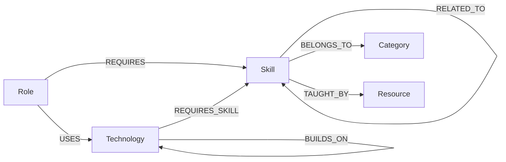

### Nodes

| Label | Properties | Count |
|---|---|---|
| `Skill` | `id`, `name`, `description`, `difficulty` (`beginner`/`intermediate`/`advanced`) | 47 |
| `Role` | `id`, `name`, `description`, `level` (`junior`/`mid`/`senior`) | 13 |
| `Technology` | `id`, `name`, `description` | 23 |
| `Resource` | `id`, `title`, `url`, `type`, `difficulty`, `provider` | 42 |
| `Category` | `id`, `name`, `description` | 8 |

`id` is a stable, human-readable slug (`machine-learning`, `ml-engineer`), unique per label and
backed by a uniqueness constraint. It appears in URLs, so it is part of the public contract — the
seed script uses it as the `MERGE` key, which is what makes re-seeding idempotent.

### Relationships

| Type | Pattern | Direction means |
|---|---|---|
| `PREREQUISITE_FOR` | `(:Skill)→(:Skill)` | learn the source before the target |
| `RELATED_TO` | `(:Skill)→(:Skill)` | **matched undirected** — relatedness is mutual, stored once |
| `REQUIRES` | `(:Role)→(:Skill)` | the role expects the skill |
| `USES` | `(:Role)→(:Technology)` | the role works with the tool |
| `REQUIRES_SKILL` | `(:Technology)→(:Skill)` | the tool assumes the competency |
| `BUILDS_ON` | `(:Technology)→(:Technology)` | the source is built on the target |
| `TAUGHT_BY` | `(:Skill)→(:Resource)` | the resource teaches the skill |
| `BELONGS_TO` | `(:Skill)→(:Category)` | grouping |

**411 relationships** across 133 nodes.

### Two modelling decisions worth defending

**Skill vs Technology.** A `Skill` is a competency; a `Technology` is a concrete product. Where the
two would collide — React is both a library and something you know — the model keeps the **Skill**
and links products to it with `REQUIRES_SKILL` (`Redux Toolkit —REQUIRES_SKILL→ React`). No concept
exists under two labels, so no query has to reconcile them.

**Roles are not linked to each other.** There is no `SIMILAR_TO` edge between roles. Similarity is
*derived* by walking out to shared skills and back, which means it can never be stale and there is
no second source of truth to maintain. This is the modelling choice the "Related roles" and "Skill
gaps" sections both depend on.

---

## How it works

### The request lifecycle

Two paths reach the database, and both end up in the same place.

**Server-rendered pages** call the service layer directly. The code already runs on the server, so
an HTTP round trip back into the same process would add latency and a serialisation step for
nothing:

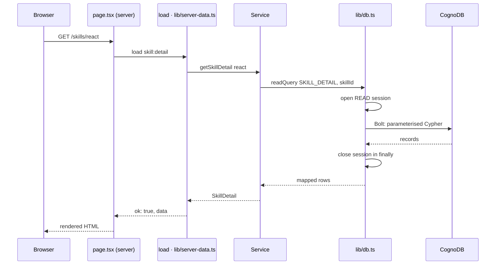

`load()` never throws. It returns `{ ok: true, data }` or `{ ok: false, unavailable, message }`, so
one failing section renders an error card instead of taking the whole route down — and the failure
mode is visible in the types.

**Client components** (search, recommendations, the path finder) go through the public API:

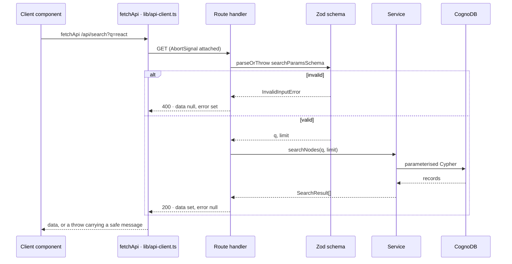

Errors converge too. Anything thrown — a Zod failure, a missing node, a dropped Bolt connection —
becomes an `AppError` carrying **two** messages: an internal one for the server log and a
`publicMessage` for the browser. Only the second is ever serialised.

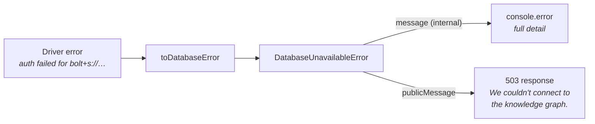

---

### User flows

Five flows, each mapped to the query behind it. Full Cypher for every one is in
[`docs/queries.md`](docs/queries.md).

#### Flow A — Search  ·  `/search` and the header  ·  [Query 1](docs/queries.md#query-1--search)

```
type "react"  →  debounce 220ms  →  abort any in-flight request
              →  GET /api/search?q=react&limit=8
              →  dropdown: React [Skill] · React — Learn [Resource]
              →  click, or Enter for the full results page
```

One query spans four labels and ranks exact match → prefix → substring **in the database**, so
`LIMIT` truncates the worst results rather than an arbitrary slice. Each result carries its label,
and [`lib/links.ts`](lib/links.ts) is the single place that decides where a label links to.

#### Flow B — Skill explorer  ·  `/skills/[id]`  ·  [Q2](docs/queries.md#query-2--skill-detail) + [Q3](docs/queries.md#query-3--multi-hop-role-discovery) + [Q5](docs/queries.md#query-5--what-should-i-learn-next)

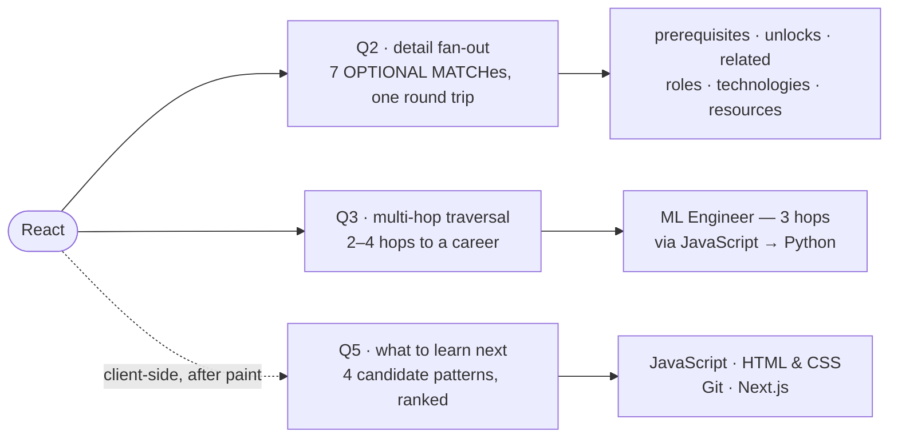

Q2 and Q3 are independent, so they run in `Promise.all`. Q5 loads client-side so the page can paint
before the ranking finishes — and it is one of the places the public API is exercised by the app
itself.

The section worth reading is **"Careers two or more hops away"**. It excludes roles that already
require the skill, so it only ever shows careers reached *through* neighbouring skills. That is
discovery, not a lookup.

#### Flow C — Career explorer  ·  `/roles/[id]`  ·  [Query 6](docs/queries.md#query-6--role-exploration)

One query fills five sections. Two of them are derived rather than stored:

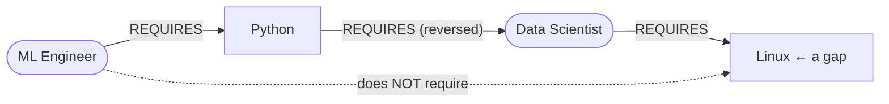

*Related roles* counts the skills on the middle hop — roles are never linked to each other, so the
similarity can never go stale. *Skill gaps* extends the same walk one hop further and subtracts what
the role already has.

#### Flow D — Learning path  ·  `/paths`  ·  [Query 4](docs/queries.md#query-4--learning-path)

```
I know [JavaScript]  →  I want to learn [Machine Learning]
        ↓  shortestPath, undirected, ≤ 5 hops
JavaScript  ──is related to──▸  Python  ──is a prerequisite for──▸  Machine Learning
```

Both selections live in the URL, so a discovered path is shareable and the skill page can deep-link
in with `?to=`. The traversal is undirected because a real route into a new field steps sideways
before it steps forward — but the service records whether each edge was walked *against* its stored
direction, so the UI says "builds on" instead of falsely implying a prerequisite.

If nothing connects the two skills, that is a **200 with `data: null`** and a dedicated empty state.
A *missing* skill is a 404. Keeping those distinct is why the endpoints are verified first.

#### Flow E — Graph explorer  ·  `/explore`  ·  [Q7](docs/queries.md#query-7--graph-neighbourhood) + [Q8](docs/queries.md#query-8--reachability-within-3-hops)

```
/explore?focus=react&depth=2      ← the entire state of the page is the URL
        ↓
Q7  neighbourhood, capped at 40 nodes, each tagged with its hop distance
Q8  reachability summary grouped by label
        ↓
click any node → router.push(?focus=<that node>) → useTransition keeps the
                 current picture on screen, dimmed, while the next one loads
```

Rings are hop distance, colour is node label. Depth selects a **pre-built** query from a frozen
table — Cypher cannot parameterise a variable-length bound, so the validated `1 | 2 | 3` is used as
a lookup key and never reaches the query text.

---

## Features at a glance

| Flow | Route | Query | What it demonstrates |
|---|---|---|---|
| **A. Search** | `/search`, header | [Q1](docs/queries.md#query-1--search) | one ranked list across four labels |
| **B. Skill explorer** | `/skills/[id]` | [Q2](docs/queries.md#query-2--skill-detail) + [Q3](docs/queries.md#query-3--multi-hop-role-discovery) | full detail in one round trip; 2–4 hop career discovery |
| **C. Career explorer** | `/roles/[id]` | [Q6](docs/queries.md#query-6--role-exploration) | derived role similarity; 3-hop skill gaps |
| **D. Learning path** | `/paths` | [Q4](docs/queries.md#query-4--learning-path) | `shortestPath` with honest edge-direction labelling |
| **E. Graph explorer** | `/explore` | [Q7](docs/queries.md#query-7--graph-neighbourhood) + [Q8](docs/queries.md#query-8--reachability-within-3-hops) | heterogeneous traversal, visualised |
| **What to learn next** | every skill page | [Q5](docs/queries.md#query-5--what-should-i-learn-next) | four candidate patterns, ranked by graph structure |

### States, everywhere

| State | How it is handled |
|---|---|
| **Loading** | Skeletons on every async section; `loading.tsx` for streamed routes; the graph keeps the previous picture dimmed with an inline "Loading graph…" rather than flashing empty |
| **Empty** | Written per case — *"No learning path could be found between these skills"* is a different message from *"This skill does not have any associated resources yet"* |
| **First run** | A connected but unseeded database shows *"Your knowledge graph is empty"* with the `npm run seed` command, not a crash |
| **Database down** | One sentence and a retry. No URI, credential, driver message or stack trace reaches the page |
| **Not found** | A 404 page that offers search instead |

## Getting started

### Prerequisites

- **Node.js 20 or newer** (`node -v`)
- A **CognoDB** account — free

### 1. Create a CognoDB instance

1. Sign up at the CognoDB console (use the signup link from your invitation).
2. Create a new instance and choose the **free C0** tier. This dataset — 133 nodes, 411
   relationships — sits well inside its limits.
3. Wait for the instance to finish provisioning.
4. Copy the **Bolt URI**. It looks like:
   ```
   bolt+s://db-a1b2c3d4.alpha.databases.cognodb.com
   ```
5. Copy the **generated password** and store it somewhere safe. Most consoles show it exactly once —
   if you lose it you will have to rotate it.
6. Note the username. It is normally `cognodb`.

### 2. Configure the application

```bash
git clone <your-repo-url>
cd skillgraph
cp .env.example .env.local
```

Open `.env.local` and fill in the three values from step 1:

```env
COGNODB_URI=bolt+s://db-xxxxxxxx.<region>.databases.cognodb.com
COGNODB_USERNAME=cognodb
COGNODB_PASSWORD=<your-password>
```

`.env.local` is git-ignored. Do not commit it, and do not put real credentials in `.env.example`.

### 3. Install, seed and run

```bash
npm install
```

```bash
npm run seed
```

```bash
npm run dev
```

Then open **http://localhost:3000**.

**What each command does**

| Command | What it does |
|---|---|
| `npm install` | Installs dependencies. |
| `npm run seed` | Connects to CognoDB, creates a uniqueness constraint per label, then `MERGE`s the dataset in [`scripts/data.ts`](scripts/data.ts). Prints a count of what it wrote. Safe to rerun — it merges on stable ids rather than creating duplicates. Add `-- --reset` to delete SkillGraph's labels first. |
| `npm run dev` | Starts the Next.js dev server on port 3000. |

**Verify it worked** — either open `http://localhost:3000/api/health`, which reports
`{"connected": true, "seeded": true, ...}` plus node counts, or run:

```bash
npm run verify
```

which executes every query in the application against your instance and prints the results. That is
the fastest way to confirm a new instance is wired up correctly.

If the graph is empty, the application does not crash — it shows an intentional first-run state
telling you to run `npm run seed`.

---

## Environment variables

| Variable | Required | Example | Notes |
|---|---|---|---|
| `COGNODB_URI` | yes | `bolt+s://db-a1b2c3d4.alpha.databases.cognodb.com` | Must use a Bolt scheme: `bolt://`, `bolt+s://`, `bolt+ssc://`, `neo4j://`, `neo4j+s://` or `neo4j+ssc://`. |
| `COGNODB_USERNAME` | yes | `cognodb` | |
| `COGNODB_PASSWORD` | yes | — | Never commit this. |
| `COGNODB_DATABASE` | no | `neo4j` | Only set this if your instance uses a non-default database name. |

**None of these are prefixed `NEXT_PUBLIC_`, and none ever will be.** Only variables with that
prefix are exposed to the browser bundle. On top of that, [`lib/db.ts`](lib/db.ts) imports
`server-only`, which makes it a *build error* for any client component to import the database layer —
so a credential leak into the client bundle fails the build rather than shipping.

Validation lives in [`lib/config.ts`](lib/config.ts) and runs lazily at request time, not at import
time, so `npm run build` succeeds on a machine with no credentials. A missing variable produces a
clear server-side message naming every variable that is absent, and a generic message to the user.

---

## Project structure

```
skillgraph/
├── app/
│   ├── api/
│   │   ├── search/route.ts             GET /api/search?q=&limit=
│   │   ├── skills/route.ts             GET /api/skills
│   │   ├── skills/[id]/route.ts        GET /api/skills/:id      (Q2 + Q3, in parallel)
│   │   ├── roles/route.ts              GET /api/roles
│   │   ├── roles/[id]/route.ts         GET /api/roles/:id       (Q6)
│   │   ├── paths/route.ts              GET /api/paths?from=&to= (Q4)
│   │   ├── graph/[id]/route.ts         GET /api/graph/:id?depth= (Q7)
│   │   ├── reach/[id]/route.ts         GET /api/reach/:id       (Q8)
│   │   ├── recommendations/[id]/route.ts  GET /api/recommendations/:id (Q5)
│   │   └── health/route.ts             GET /api/health
│   ├── skills/[id]/page.tsx            Flow B  (+ loading.tsx)
│   ├── roles/[id]/page.tsx             Flow C  (+ loading.tsx)
│   ├── paths/page.tsx                  Flow D
│   ├── explore/page.tsx                Flow E  (+ loading.tsx)
│   ├── search/page.tsx                 Flow A
│   ├── skills/page.tsx  roles/page.tsx browse pages
│   ├── page.tsx  layout.tsx  error.tsx not-found.tsx  globals.css
│
├── components/
│   ├── ui/index.tsx                    design-system primitives
│   ├── ui/DatabaseStates.tsx           empty-graph and unavailable states
│   ├── search/SearchBar.tsx            debounced, abortable instant search
│   ├── skills/RecommendationList.tsx   Q5, loaded client-side
│   ├── skills/ResourceList.tsx         shared by skill and role pages
│   ├── learning-path/PathFinder.tsx    Flow D, state in the URL
│   └── graph/GraphView.tsx             hand-rolled radial SVG graph
│       graph/GraphExplorer.tsx         interactive shell
│
├── lib/
│   ├── db.ts                           driver singleton, readQuery, error mapping   [server-only]
│   ├── config.ts                       environment parsing and validation           [pure]
│   ├── cypher-params.ts                JS number → Bolt integer conversion
│   ├── errors.ts                       AppError hierarchy: public vs internal message
│   ├── api.ts                          the { data, error } response envelope
│   ├── api-client.ts                   browser-side counterpart
│   ├── server-data.ts                  load(): Loaded<T> for server components      [server-only]
│   ├── validation.ts                   Zod schemas for every route input
│   ├── mappers.ts                      Cypher maps → typed domain objects
│   ├── links.ts                        one place that decides where a node links to
│   ├── types.ts                        every domain and transport type
│   ├── queries/                        ← ALL Cypher lives here, nowhere else
│   │   ├── search.ts  stats.ts  skills.ts  roles.ts  paths.ts
│   │   ├── recommendations.ts  graph.ts
│   │   └── index.ts
│   └── services/                       queries + mapping + ordering
│       ├── search.ts  skills.ts  roles.ts  paths.ts
│       ├── recommendations.ts  graph.ts  stats.ts  shared.ts
│
├── scripts/
│   ├── data.ts                         the seed dataset + integrity validation
│   ├── seed.ts                         npm run seed
│   └── verify-queries.ts               npm run verify
│
├── tests/                              145 tests, no database required
└── docs/
    ├── queries.md                      every query: purpose, params, traversal, rationale
    ├── demo-script.md                  screen-recording outline
    └── screenshots/
```

**The separation that matters:** Cypher lives only in `lib/queries/`. Services run those queries and
map results. Route handlers validate input and shape responses. Pages render. Nothing skips a layer,
so the whole data-access surface of the application is reviewable by reading one directory.

### Server components call services directly

Pages do **not** fetch their own API routes. They already run on the server, so an HTTP round trip
back into the same process would add latency and a serialisation step for nothing. The API routes
exist for the client components — search, the recommendation panel, the path finder — and both paths
go through the same services and the same queries.

---

## API

Every endpoint returns the same envelope, for success and failure alike:

```jsonc
// success
{ "data": [ ... ], "error": null }

// failure
{ "data": null, "error": { "code": "NOT_FOUND", "message": "That skill could not be found." } }
```

| Method | Route | Parameters | Notes |
|---|---|---|---|
| `GET` | `/api/search` | `q` (2–64 chars), `limit` (1–50, default 20) | |
| `GET` | `/api/skills` | — | flat list, for the path pickers |
| `GET` | `/api/skills/:id` | — | detail **plus** the multi-hop role traversal |
| `GET` | `/api/roles` | — | |
| `GET` | `/api/roles/:id` | — | |
| `GET` | `/api/paths` | `from`, `to` | `200` with `data: null` when no route exists |
| `GET` | `/api/graph/:id` | `depth` (1, 2 or 3, default 2) | |
| `GET` | `/api/reach/:id` | `limit` (1–25, default 10) | |
| `GET` | `/api/recommendations/:id` | `limit` (1–20, default 8) | |
| `GET` | `/api/health` | — | `{ connected, seeded, stats }` |

Error codes: `INVALID_INPUT` (400), `NOT_FOUND` (404), `DATABASE_UNAVAILABLE` /
`DATABASE_NOT_CONFIGURED` (503), `INTERNAL_ERROR` (500).

**"No route between these skills" is a 200, not a 404.** It is a correct answer to a valid question,
and the UI has a dedicated empty state for it. A *missing* skill is a 404. Keeping those distinct is
why the path service verifies both endpoints before running `shortestPath`.

**There is no endpoint that accepts Cypher.** The API exposes seven fixed, parameterised questions.

---

## Scripts

| Script | Purpose |
|---|---|
| `npm run dev` | Development server. |
| `npm run build` | Production build. |
| `npm start` | Serve the production build. |
| `npm run lint` | ESLint (`next/core-web-vitals` + `next/typescript`, `no-explicit-any` as an error). |
| `npm run typecheck` | `tsc --noEmit` in strict mode. |
| `npm test` | Vitest — 145 tests, no database needed. |
| `npm run seed` | Load the dataset into CognoDB. `-- --reset` clears SkillGraph's labels first. |
| `npm run verify` | Execute every query against the configured database and print the results. |

---

## Testing

Lint, typecheck, tests and build run on every push and pull request via
[GitHub Actions](.github/workflows/ci.yml). The build step deliberately runs with **no** `COGNODB_*`
variables set — configuration is read lazily at request time rather than at import time, so a
missing credential has to produce a friendly runtime state, not a broken build. CI would catch a
regression that moved that validation to module load.


```bash
npm test
```

145 tests across eight files, none of which need a database:

| File | Covers |
|---|---|
| `config.test.ts` | Missing/blank/whitespace env vars, every valid URI scheme, rejection of invalid ones, and that the password never reaches an error message. |
| `validation.test.ts` | Every route schema: length bounds, limit caps, the id slug pattern (including `../../etc/passwd` and quote-injection attempts), depth allow-list, and that no raw Zod message reaches a user. |
| `db-errors.test.ts` | The internal-vs-public message contract: a driver error keeps its detail for the log and loses it in the response. |
| `api.test.ts` | The `{ data, error }` envelope, correct status per error type, and that a stack trace or connection string can never be serialised. |
| `services.test.ts` | With the driver mocked: `shortestPath` results becoming ordered steps **including reversed-edge detection**, recommendation reason wording, `NotFound` on unknown ids, null-entry filtering, and that depth selects a pre-built query rather than a constructed string. |
| `queries.test.ts` | Properties of every query: no `${` interpolation, no write clauses, no unbounded `[*`, plus the specific traversal each feature depends on. |
| `seed-data.test.ts` | Referential integrity, slug-shaped ids, unique HTTPS resource URLs, no duplicate or self edges, **no prerequisite cycle**, size targets, and that no skill is isolated. |
| `cypher-params.test.ts` | Regression test for the integer/float bug described below. |

### Engine portability: one real CognoDB dialect difference

Everything in this project is standard openCypher, and 21 of the 23 query executions behaved
identically the first time they ran against CognoDB. Two did not, and the way they failed is worth
knowing about.

**CognoDB evaluates a pattern predicate as a constant `true`.** A pattern predicate is a graph
pattern used as a boolean inside `WHERE`:

```cypher
MATCH (role:Role)
WHERE NOT (role)-[:REQUIRES]->(:Skill {id: 'react'})   -- portable? no.
RETURN count(role)
```

On Neo4j this returns 11 — the roles that do not require React. On CognoDB the positive form
`WHERE (role)-[:REQUIRES]->(...)` matches **all 13** roles, so the negated form matches **none**.
There is no error and no warning. The query succeeds and returns an empty result.

That broke two features silently:

- *"Careers two or more hops away"* returned nothing, because
  `NOT (role)-[:REQUIRES]->(start)` discarded every candidate.
- *"Skill gaps"* returned nothing, for the same reason.

Both now use an **anti-join through a collected id list**, which is plain `MATCH` / `collect` / `IN`
and behaves identically on both engines:

```cypher
OPTIONAL MATCH (direct:Role)-[:REQUIRES]->(start)
WITH start, collect(DISTINCT direct.id) AS directRoleIds

MATCH path = (start)-[...]-(reached:Skill)<-[:REQUIRES]-(role:Role)
WHERE reached <> start
  AND NOT role.id IN directRoleIds
```

The results now match Neo4j exactly, node for node.

Two things guard against a regression:

- `tests/queries.test.ts` fails the build if any query uses a graph pattern as a boolean in a
  predicate line.
- `scripts/verify-queries.ts` asserts each query's **contract**, not just that rows came back — for
  example, that no role which requires React directly appears in the "two or more hops away" list,
  and that no skill the role already has is reported as a gap.

**The general lesson is the second one.** The original verify script only checked "did this return
rows?", and a silently-empty result passes that check. A vendor difference that returns *wrong data
without an error* is the dangerous kind, and only an assertion about what the answer must satisfy
catches it.

### Verifying against a real Bolt endpoint

`npm run verify` needs a live database. Because CognoDB speaks standard openCypher over Bolt, *any*
Bolt-compatible engine works for this — which is itself a useful property, since it means the
queries are not tied to one vendor. During development they were checked against a throwaway
container:

```bash
docker run -d --name skillgraph-check -p 7687:7687 -e NEO4J_AUTH=neo4j/localpassword neo4j:5-community
```

with `.env.local` pointed at `bolt://localhost:7687`, then `npm run seed && npm run verify`. Every
one of the 23 query executions in `scripts/verify-queries.ts` passes there and against CognoDB, with
no change to the Cypher, the driver configuration or the seed script.

### A bug the unit tests could not have caught

`npm run verify` runs every query against a live Bolt endpoint. The first time it ran, eight queries
failed:

```
LIMIT: Invalid input. '10.0' is not a valid value. Must be a non-negative integer.
```

Bolt distinguishes integers from floats, and the driver encodes a plain JavaScript `number` as a
**float** — so `LIMIT $limit` with `limit: 10` arrives as `LIMIT 10.0` and the server rejects it.
`disableLosslessIntegers` only affects values coming *back*. Every paginated query in the
application would have failed in production while passing every unit test.

The fix is [`lib/cypher-params.ts`](lib/cypher-params.ts), applied inside `readQuery` so no caller
has to remember, plus a regression test. This is why `npm run verify` exists and why it is worth
running against a new instance.

---

## Deployment

The application is a standard Next.js app with no persistent local state, so it deploys to Vercel's
free tier without modification.

1. Push the repository to GitHub.
2. In the [Vercel dashboard](https://vercel.com/new), import the repository. Vercel detects Next.js;
   the default build command and output directory are correct.
3. Before the first deploy, add the environment variables under
   **Settings → Environment Variables**:

   | Name | Value | Environments |
   |---|---|---|
   | `COGNODB_URI` | `bolt+s://db-xxxxxxxx.<region>.databases.cognodb.com` | Production, Preview, Development |
   | `COGNODB_USERNAME` | `cognodb` | Production, Preview, Development |
   | `COGNODB_PASSWORD` | your password — mark it **Sensitive** | Production, Preview, Development |

   **Do not prefix any of them with `NEXT_PUBLIC_`.** That prefix inlines a value into the browser
   bundle. These three must stay server-side, which is what keeps the database reachable only from
   the server.
4. Deploy.
5. Seed the database if you have not already. The seed runs from your machine against the same
   CognoDB instance — the hosted app reads whatever is there:
   ```bash
   npm run seed
   ```
6. Confirm the deployment with `https://your-app.vercel.app/api/health`. It should report
   `{"connected": true, "seeded": true, ...}`. If `connected` is false the credentials are wrong; if
   `seeded` is false the database is empty.
7. Replace the [Live demo](#live-demo) placeholder in this README with the deployed URL.

### How the live demo was deployed

For the record, the deployment above was made from the CLI rather than the dashboard:

```bash
vercel link --yes --project skillgraph

# Values piped from .env so they are never echoed to the terminal or shell history.
printf '%s' "$COGNODB_URI"      | vercel env add COGNODB_URI production
printf '%s' "$COGNODB_USERNAME" | vercel env add COGNODB_USERNAME production
printf '%s' "$COGNODB_PASSWORD" | vercel env add COGNODB_PASSWORD production

vercel --prod --yes
```

One extra step is easy to miss: new Vercel projects enable **SSO deployment protection**, which
returns a `302` to a Vercel login page for anyone who is not a team member. A demo link that only
the owner can open is not a demo, so it was turned off:

```bash
vercel project protection            # show current settings
vercel project protection disable --sso
```

Verify with the health endpoint, which distinguishes the two failure modes — bad credentials
(`connected: false`) from an unseeded database (`seeded: false`):

```bash
curl -s https://skillgraph-qadir-khan.vercel.app/api/health
# {"data":{"connected":true,"seeded":true,"stats":{...}},"error":null}
```

**Notes**

- Every page is `dynamic = "force-dynamic"`. The data is read from the graph on each request, and
  caching a stale graph would make the traversals confusing rather than fast. Adding
  `revalidate` per route would be a sensible next step.
- The Neo4j driver is listed in `serverExternalPackages` because it opens raw TCP/TLS sockets for
  Bolt and must not be bundled.
- Serverless functions are short-lived, so the driver's connection pool is created per instance
  rather than shared globally. The pool is capped at 10 connections to stay well inside free-tier
  limits.

---

## Security

| Concern | How it is handled |
|---|---|
| Credentials in source | None. Three environment variables, validated in [`lib/config.ts`](lib/config.ts). `.env*` is git-ignored except `.env.example`, which holds placeholders only. |
| Credentials in the client bundle | [`lib/db.ts`](lib/db.ts) imports `server-only` — a client component importing it is a **build error**, not a runtime surprise. No `NEXT_PUBLIC_` variable exists. |
| Cypher injection | Every user value is a Cypher parameter. `tests/queries.test.ts` fails the build if a `${` appears in any query. The one literal the language requires — a variable-length depth bound — is handled with a frozen table of pre-built queries selected by a validated key; see [Query 7](docs/queries.md#query-7--graph-neighbourhood). |
| Arbitrary queries | No endpoint accepts Cypher. Seven fixed questions, each with a schema. |
| Input validation | Zod on every route: length bounds, numeric ranges, and a slug pattern for ids. Rejected before any database round trip. |
| Write access from the web | There is none. Every query in the application is read-only and runs in a `READ`-mode session; `tests/queries.test.ts` asserts no query contains a write clause. Only the seed script writes. |
| Error disclosure | [`AppError`](lib/errors.ts) carries a `publicMessage` and an internal `message`. Routes serialise only the former; the latter goes to the server log. Unexpected errors become a generic 500. Verified in `api.test.ts`. |
| Transport | `bolt+s://` is TLS. The URI scheme is validated at startup. |

Verified by hand against a running instance — an id of `react' DETACH DELETE n //` is rejected with
`400 INVALID_INPUT` and the graph is untouched:

```bash
curl -sL "http://localhost:3000/api/skills/react%27%20DETACH%20DELETE%20n%20//"
# {"data":null,"error":{"code":"INVALID_INPUT","message":"Ids may only contain lowercase letters, numbers and hyphens."}}
```

---

## Performance

The free tier is small, so the application is deliberately frugal:

- **One query per page section, not one per row.** The skill and role detail pages each fetch
  everything they need in a single query using `OPTIONAL MATCH` + `collect` — there is no N+1
  anywhere.
- **Independent queries run concurrently.** `/api/skills/:id` runs the detail fan-out and the
  multi-hop traversal in `Promise.all`; the homepage runs its three queries the same way.
- **Every traversal is bounded** — `*1..3`, `*..5`, never `[*]`. A test asserts this.
- **Every query returns only the properties the UI renders**, projected as explicit maps rather than
  whole nodes.
- **The visualisation is capped at 40 neighbours** and reports `truncated` so the UI can say the view
  is partial rather than implying it is complete.
- **Sessions are always closed** in a `finally`, and the driver is a singleton so a request does not
  pay for a TLS handshake.
- **`disableLosslessIntegers`** avoids allocating an Integer object per numeric field.
- Uniqueness constraints double as indexes, so `MATCH (s:Skill {id: $skillId})` is an index lookup.

---

## Design decisions

A short list of the choices worth explaining, and why.

**No graph-visualisation library.** The nodes already carry their hop distance from the focus node,
so a radial layout — focus in the centre, one ellipse per hop — draws exactly the thing the user
asked about. It is deterministic (the same query always renders the same picture), there is no
simulation to tune, and it is ~150 lines of SVG in [one file](components/graph/GraphView.tsx). A
force-directed library would add a dependency, a physics simulation and non-determinism to produce a
*less* informative picture.

**URL as state on `/explore` and `/paths`.** `?focus=react&depth=3` is the entire state of the
explore page. Views are shareable, the back button works, and the server does the querying.
`useTransition` keeps the current graph on screen while the next one loads.

**Undirected `shortestPath`, with honest labelling.** A directed-only traversal returns "no path" for
most cross-discipline pairs. Traversing undirected finds real routes, and the service records
whether each edge was walked against its stored direction so the UI can say *"builds on"* rather
than falsely implying *"is a prerequisite for"*.

**Ranking in Cypher, wording in TypeScript.** The recommendation score depends on graph structure —
relationship kind and `REQUIRES` in-degree — so it belongs in the query. The sentence explaining a
recommendation is presentation, so it belongs in the service.

**Sorting collected lists in TypeScript.** Ordering seven collected lists inside `SKILL_DETAIL` would
need seven extra `WITH ... ORDER BY` stages for no measurable gain on lists of this size.

**Tailwind design tokens, no `dark:` variants.** Every colour is a token in
[`globals.css`](app/globals.css). Dark mode re-declares the same variables inside one media query,
so no component carries a variant — and the graph, the badges and the pages cannot disagree about
what a "Skill" looks like.

---

## What I would do with more time

- **Authentication and a user profile**, so "skills I already have" is persisted and the
  recommendations become personal rather than relative to one skill.
- **Better recommendations.** The current score is a transparent weighted sum, which is easy to
  explain and easy to defend. Real collaborative filtering over co-occurrence, or a graph embedding,
  would rank better — at the cost of being much harder to justify to a user.
- **Graph analytics** — PageRank over `PREREQUISITE_FOR` to find genuinely foundational skills, and
  community detection to discover categories rather than hand-assigning them.
- **A full-text index** to replace the `CONTAINS` scan, with real relevance scoring.
- **Caching.** Most of this data changes rarely; per-route `revalidate` plus a small in-process LRU
  in front of the hot queries would cut database traffic substantially.
- **Pagination** on search and the browse pages, which currently return everything because the
  dataset is small enough to make that the simpler correct choice.
- **Observability** — query timings per Cypher statement, slow-query logging, and an error tracker
  so the messages currently going to `console.error` land somewhere durable.
- **Integration tests against a real database.** `npm run verify` is a manual step today; running it
  against a throwaway Bolt container in CI would make it a gate.
- **A larger, sourced dataset.** 47 skills is enough to make the traversals interesting; a few
  thousand, derived from real job postings, would make the recommendations genuinely useful.
